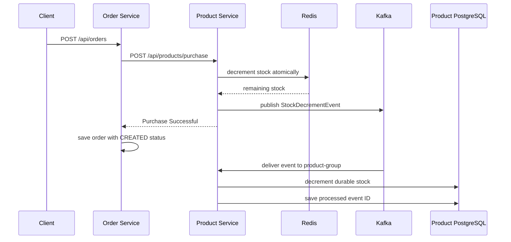

# Kafka in This Flash-Sale Project

This guide explains the Kafka flow currently implemented in this repository and provides concise interview-ready answers.

## 1. Why Kafka is used here

During a flash sale, many purchase requests can arrive at the same time. The product service must respond quickly after reserving stock in Redis. Updating the durable product stock in PostgreSQL can happen asynchronously.

Kafka separates these two responsibilities:

1. Redis performs the immediate stock reservation.
2. Kafka records a `StockDecrementEvent`.
3. A Kafka consumer applies the decrement to PostgreSQL.

This reduces request latency and smooths sudden traffic spikes. It is an **eventually consistent** design: Redis is updated first, while the database is updated shortly afterwards by the consumer.

## 2. End-to-end flow in this project



The order service does **not** publish this Kafka event. It calls the product service synchronously through `ProductClient`. The product service publishes the event only after the Redis decrement succeeds.

Relevant classes:

- `order_service/.../OrderService.java` starts the flow.
- `product-service/.../ProductService.java` decrements Redis and calls `stockEventProducer.publish(...)`.
- `product-service/.../StockEventProducer.java` sends the event to Kafka.
- `product-service/.../StockEventConsumer.java` consumes the event and updates PostgreSQL.

## 3. How the event is published

`ProductService.decrementStock(...)` calls:

```java
stockEventProducer.publish(request.getProductId(), quantity);
```

`StockEventProducer.publish(...)` creates an immutable event and sends it:

```java
kafkaTemplate.send(
    "stock-decrement-topic",
    new StockDecrementEvent(
        UUID.randomUUID(), // eventId
        UUID.randomUUID(), // currently generated orderId
        productId,
        quantity,
        Instant.now()
    )
);
```

`KafkaTemplate.send(...)` serializes the Java object to bytes, selects a Kafka partition, and sends the record to the `stock-decrement-topic` topic. The call is asynchronous: it returns immediately with a future rather than waiting for Kafka acknowledgement.

The event payload is logically similar to:

```json
{
  "eventId": "...",
  "orderId": "...",
  "productId": "...",
  "quantity": 2,
  "createdAt": "2026-07-26T10:15:30.123Z"
}
```

## 4. What `KafkaConfig` does

`product-service/.../common/config/KafkaConfig.java` explicitly creates the producer objects used by `StockEventProducer`.

### `@Configuration`

`@Configuration` tells Spring that this class declares beans. At application startup Spring invokes the methods annotated with `@Bean` and adds their return values to the application context.

### `stockEventProducerFactory(...)`

This bean creates a `ProducerFactory<String, StockDecrementEvent>`.

It configures:

| Setting | Purpose |
| --- | --- |
| `bootstrap.servers` | Kafka broker address, injected from `spring.kafka.bootstrap-servers` (`kafka:9092` in Docker). |
| `StringSerializer` | Converts the Kafka record key from `String` to bytes. |
| `JsonSerializer` | Converts `StockDecrementEvent` from a Java object to JSON bytes. |
| `ObjectMapper + JavaTimeModule` | Lets Jackson correctly serialize Java time types such as `Instant`. |
| `WRITE_DATES_AS_TIMESTAMPS` disabled | Writes timestamps as readable ISO-8601 strings rather than numeric arrays/timestamps. |

The Java Time mapper is the important serialization fix. Without it, Jackson can fail with an error similar to: `Java 8 date/time type java.time.Instant not supported by default`.

### `kafkaTemplate(...)`

This bean builds a `KafkaTemplate<String, StockDecrementEvent>` from the factory. Spring injects that template into `StockEventProducer` through Lombok's generated constructor.

In short:

```text
KafkaConfig -> ProducerFactory -> KafkaTemplate -> StockEventProducer -> Kafka topic
```

Because the application defines its own `KafkaTemplate`, it is the template used by `StockEventProducer`. The producer serializer entries in `application.yml` document the desired serializers, but the custom factory supplies the serializers that are actually used by this template.

## 5. How the event is consumed

`StockEventConsumer` uses:

```java
@KafkaListener(topics = "stock-decrement-topic", groupId = "product-group")
public void consume(StockDecrementEvent event)
```

Spring creates a listener container for this method. The consumer configuration in `application.yml` tells it to use `JsonDeserializer` and to deserialize the value as `StockDecrementEvent`.

The consumer then:

1. Checks `processed_events` for the `eventId`.
2. Returns without changing stock if the event was processed already.
3. Decrements stock in PostgreSQL.
4. Stores the event ID in `processed_events`.

The `@Transactional` annotation makes steps 3 and 4 one database transaction. If saving the processed event fails, the database decrement is rolled back too.

## 6. Kafka concepts to explain in an interview

| Concept | Interview-ready explanation |
| --- | --- |
| Topic | A named, durable stream of records. Here it is `stock-decrement-topic`. |
| Producer | An application that writes events. Here, `StockEventProducer`. |
| Consumer | An application that reads events. Here, `StockEventConsumer`. |
| Partition | An ordered, parallel unit inside a topic. Ordering is guaranteed only within one partition. |
| Consumer group | Consumers sharing a group divide topic partitions among themselves. `product-group` allows horizontal scaling without each instance processing every record. |
| Offset | The position of a record in a partition. Kafka commits offsets so a consumer can resume after restart. |
| Serialization | Conversion of a Java object into bytes before sending to Kafka. |
| Deserialization | Conversion of Kafka bytes back into a Java object while consuming. |
| At-least-once delivery | Kafka can redeliver an event after a failure, so consumers must be idempotent. |

## 7. Why idempotency is needed

Kafka consumers are commonly **at least once**. For example, the database transaction may commit but the application may stop before Kafka records the offset commit. On restart, Kafka delivers the event again.

Without protection, the same stock decrement would be applied twice. This project prevents that by storing `eventId` in `processed_events` and checking it before decrementing product stock.

For production, make `eventId` a primary key or unique constraint (it is currently the entity ID) and handle a duplicate-key exception safely. That gives a database-level guarantee even if two consumer threads race.

## 8. Important improvements to discuss in an interview

The current code is a solid learning implementation, but these improvements are important in production:

1. **Use the real order ID.** `StockEventProducer` currently generates a new `orderId`. Create the order first, then pass its real ID in `PurchaseRequest` and the stock event.
2. **Use the product ID as the Kafka key.** Call `kafkaTemplate.send(topic, productId.toString(), event)`. All events for one product then go to the same partition, preserving product-level event order.
3. **Handle send failures.** Inspect the future returned by `send`, attach a callback, and add logging/metrics. A Redis decrement that succeeds while Kafka publishing fails creates inconsistency.
4. **Use the transactional outbox pattern.** Save the stock change and an outbox event in the same database transaction; a separate publisher sends the outbox row to Kafka. This avoids the database/Kafka dual-write problem.
5. **Add retries and a dead-letter topic (DLT).** Transient consumer failures should retry; malformed or permanently failing messages should move to a DLT for investigation.
6. **Use meaningful event names and versions.** For example, `StockReserved.v1` or `StockDecremented.v1`. Event schemas are contracts and need backward-compatible evolution.
7. **Configure producer reliability.** Common settings are `acks=all`, idempotence enabled, retries, and sensible delivery timeout values.

## 9. Common interview questions and strong answers

### Why Kafka instead of a synchronous database update?

Kafka absorbs traffic bursts and decouples the fast purchase path from slower downstream work. The trade-off is eventual consistency and the need for idempotency and failure handling.

### Does Kafka guarantee exactly-once processing?

Not automatically across a normal Kafka consumer and an external database. Kafka can provide exactly-once semantics for Kafka read-process-write flows with transactions, but database updates usually require idempotent consumer logic or an outbox/inbox pattern. This project uses an inbox-style `processed_events` table for idempotency.

### How do you preserve event order for one product?

Use `productId` as the Kafka message key. Kafka hashes equal keys to the same partition, and Kafka preserves record order inside a partition.

### What happens if the consumer crashes?

Kafka delivers the message again from the last committed offset. The `processed_events` lookup prevents the durable stock decrement from being applied twice.

### Why use `Instant` rather than `LocalDateTime` in an event?

`Instant` represents one unambiguous moment in UTC. `LocalDateTime` has no time zone or offset, so two services in different regions can interpret it differently. `Instant` is better for cross-service events, auditing, and storage.

### Why was custom `KafkaConfig` needed?

The event contains `Instant`. The custom JSON serializer uses a Jackson `ObjectMapper` with `JavaTimeModule`, which makes the Java time type serializable as JSON. It also makes the serialization behavior explicit instead of depending on framework defaults.

## 10. One-minute explanation for an interviewer

> In our flash-sale system, the order service calls the product service to reserve stock. The product service atomically decrements Redis so the user gets a fast decision. After that succeeds, it publishes a `StockDecrementEvent` to Kafka. A consumer in the product service reads the event and updates PostgreSQL asynchronously. The producer uses a Kafka template configured with JSON serialization and Jackson's Java Time module, so fields such as `Instant` serialize correctly. Since Kafka delivery is at least once, the consumer stores processed event IDs and skips duplicates. In production I would key messages by product ID, use retries and a dead-letter topic, and adopt an outbox pattern to prevent Redis/database/Kafka dual-write inconsistencies.
